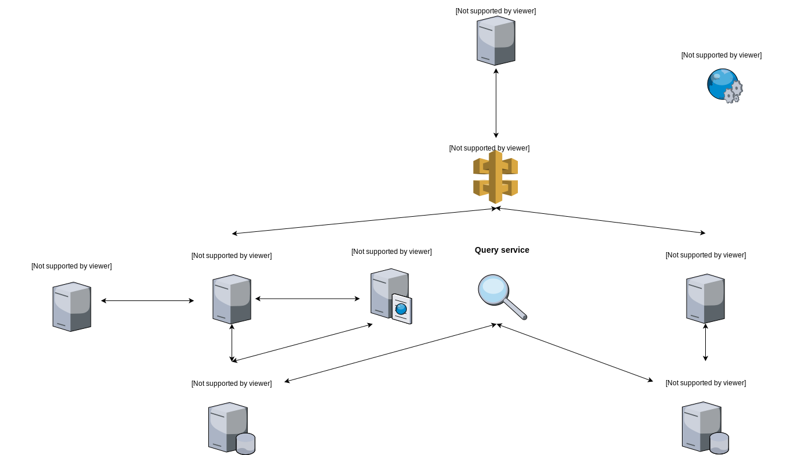

# Demetria social network

Demetria is a social network based on a microservice architecture.

# Current status (on major functionalities)

- [x] CRUD operations (Create account, Read(display) posts, Update user information, Delete a post)
- [ ] Separate user service & post service
- [ ] Register OpenGraph service with eureka
- [ ] Integrate OpenGraph with post service
- [ ] Create friendship relation
- [ ] Implement votes and comments on posts
- [ ] Implement & design search service


# General architecure



### Tech stack

Some of the (open source) technologies that has been used:

* [Docker] - HTML enhanced for web apps!
* [Spring Boot] - awesome web-based text editor
* [Spring Data] - Markdown parser done right. Fast and easy to extend.
* [Thymleaf] - server-side Java template engine
* [Netlix Eureka] - for service registration & service discovery
* [Bootstrap] - responsive design
* [jQuery] - JS library, used especially for ajax(async) requests
* [REST] - communicate over microservices

### Installation
Demetria requires a minimum setup for Docker Compose.
Once Docker-Compose is installed:
```sh
$ docker-compose up .
```
**TODO: setup docker-compose file**
### Docker
**to be populated**
### Todos
----
Mainly, too many to enumerate. Some of them are in issues section, others (with more general character) here:
 - Create Dockerfile for microservices
 - Setup docker-compose file
 - Test (from time to time) Docker deployment
 - Write (MORE) Tests

### Screenshots
----
**Homepage** - for not logged-in/non-registered users


**Timeline** - homepage for logged-in users. It will contain posts from friends.


**User posts** - timeline restricted to user posts


**User settings** - contains settings for an account


#### License
----
MIT

**Free Software, Hell Yeah!**

[//]: # (These are reference links used in the body of this note and get stripped out when the markdown processor does its job. There is no need to format nicely because it shouldn't be seen. Thanks SO - http://stackoverflow.com/questions/4823468/store-comments-in-markdown-syntax)

[Docker]: https://www.docker.com/
[Spring Boot]: https://spring.io/projects/spring-boot
[Spring Data]: https://spring.io/projects/spring-data
[Thymleaf]: https://www.thymeleaf.org/
[Netlix Eureka]: https://github.com/Netflix/eureka
[Bootstrap]: https://getbootstrap.com/
[REST]: https://restfulapi.net/
[jQuery]: <http://jquery.com>
